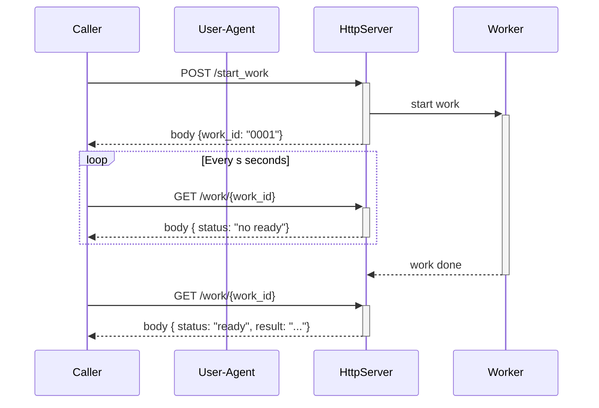
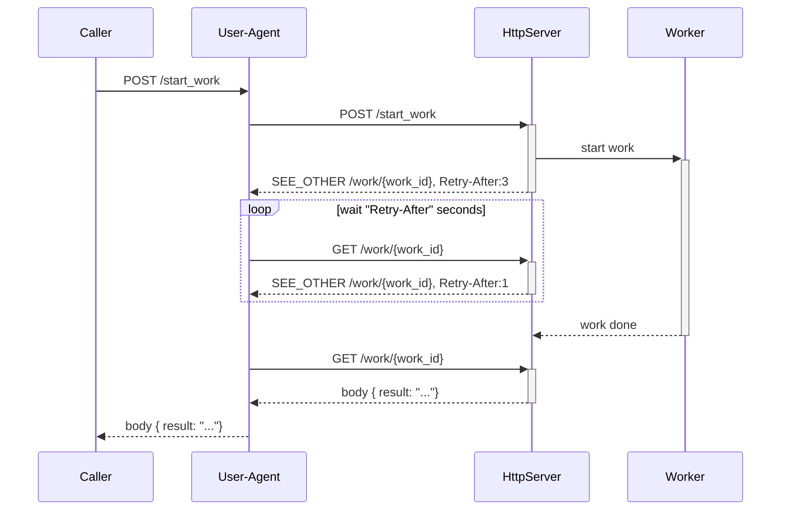

# Experimentation: Polling with http

Polling is a way to handle long or delayed work without blocking a TCP connection. To do polling on http server we need at least 2 endpoints:

- the endpoint to start the work (eg: `POST /start_work`)
- the endpoint to provide the result of the work when ready, or a "not ready yet" status to tell "retry later" (eg `GET /work/{work_id}`)



This approach imply a **per endpoint** logic :-( !

- how to ready `work_id` form the result of `POST /start_work`
- how to convert `work_id` into request for `GET /work/{work_id}` and handle the response
- the retry interval is defined by documentation or arbitrary value

## Concept Evolution

- the server provide the interval, or at least an estimation for when to try next time
- the server provide the endpoint to get the result
- the information are provided via http status code & attribute like handling of authentication, trace, circuit breaker, rate-limit...

So on caller side, the logic can handled in a endpoint agnostic way (eg at the user-agent wrapper level), and reuse for every endpoint that use polling.



### Pros

- server can adjust `Retry-After`, with estimation based on current load, progress of the work,...
- server can adjust the location of the response maybe to add complementary query param,...
- the protocol becomes is agnostic of the endpoint (may could become a "standard")
- the caller & user-agent are free to handle the polling as they want, it could like in the first example (with more information) or with a more complex way with queue intermediate state, via sidecar or proxy...
  - user-agent is free to follow redirect automatically or not, and to handle them as a blocking or non-blocking way
  - user-agent handle retry-after like retries on
    - rate-limit: 429 (Too Many Request) + Retry-After
    - downtime: 503  (Service Unavailable) + Retry-After
    - ...
  - the `work_id` & polling can be nearly hide to Caller, it's like a regular POST request that return the response

### Cons

- the Caller should handle response of `GET /work/{work_id}` as response of `POST /start_work` (both possible error,...)
- Maybe the default implementation of user agent for follow redirect should be changed or handled by the wrapper
  - the user-agent should change the method from POST to GET on redirection (allowed for 301 (Move Permanently), 302 (Found), 303 (See Other)), this behavior can coded at the user-agent wrapper level.
  - some user-agent don't handle `Retry-After` (remember http header are case insensitive)
  - Some user-agent have a maximum number of redirect (eg with curl `Maximum (50) redirects followed`)

### References

Extracted from [RFC 7231 - Hypertext Transfer Protocol (HTTP/1.1): Semantics and Content](https://datatracker.ietf.org/doc/html/rfc7231#section-6.4.4) similar info available at M

- `303 See Other`
  
  > ... This status code is applicable to any HTTP method.  It is primarily used to allow the output of a POST action to redirect the user agent to a selected resource, since doing so provides the information corresponding to the POST response in a form that can be separately identified, bookmarked, and cached, independent of the original request. ...

- `Retry-After`
  > ... When sent with any 3xx (Redirection) response, Retry-After indicates the minimum time that the user agent is asked to wait before issuing the redirected request. ...

Extracted from [Retry-After - HTTP | MDN](https://developer.mozilla.org/en-US/docs/Web/HTTP/Headers/Retry-After)

> The Retry-After response HTTP header indicates how long the user agent should wait before making a follow-up request. There are three main cases this header is used:
>
> - When sent with a 503 (Service Unavailable) response, this indicates how long the service is expected to be unavailable.
> - When sent with a 429 (Too Many Requests) response, this indicates how long to wait before making a new request.
> - When sent with a redirect response, such as 301 (Moved Permanently), this indicates the minimum time that the user agent is asked to wait before issuing the redirected request.

## Implementations (aka PoC)

### A basic server

For the PoC, I created a basic http service in Rust. The code is available at [sandbox_http/polling/server-axum at development · davidB/sandbox_http](https://github.com/davidB/sandbox_http/tree/development/polling/server-axum).

```rust
async fn start_work(Extension(works): Extension<WorkDb>) -> impl IntoResponse {
    let mut rng: StdRng = SeedableRng::from_entropy();
    let work_id = Uuid::new_v4();
    let duration = Duration::from_secs(rng.gen_range(1..=20));
    let end_at = Instant::now() + duration;

    let get_url = format!("/work/{}", work_id);
    let next_try = duration.as_secs() / 2;

    let mut works = works.lock().expect("acquire works lock to start_work");
    works.insert(
        work_id,
        Work {
            work_id,
            end_at,
            duration,
            nb_get_call: 0,
        },
    );
    (
        StatusCode::SEE_OTHER,
        [
            (http::header::LOCATION, get_url),
            (http::header::RETRY_AFTER, format!("{}", next_try)),
        ],
    )
}

async fn work(Path(work_id): Path<Uuid>, Extension(works): Extension<WorkDb>) -> impl IntoResponse {
    let mut works = works.lock().expect("acquire works lock to get_work");
    tracing::info!(?work_id, "request work result");
    match works.get_mut(&work_id) {
        None => (StatusCode::NOT_FOUND).into_response(),
        Some(work) => {
            if work.end_at > Instant::now() {
                work.nb_get_call += 1;

                let get_url = format!("/work/{}", work.work_id);
                let next_try = 1;
                (
                    StatusCode::SEE_OTHER,
                    [
                        (http::header::LOCATION, get_url),
                        (http::header::RETRY_AFTER, format!("{}", next_try)),
                    ],
                )
                    .into_response()
            } else {
                (StatusCode::OK, Json(work.clone())).into_response()
            }
        }
    }
}
```

### Caller with curl

```sh
curl -v --location "http://localhost:8080/start_work" -d ""
```

- Do not use `-X POST` but `-d ""`  else redirection will not switch from `POST` to `GET`
- Failed because curl doesn't support `Retry-After` when follow redirection (see date in the sample below)

```txt
*   Trying 127.0.0.1:8080...
* Connected to localhost (127.0.0.1) port 8080 (#0)
> POST /start_work HTTP/1.1
> Host: localhost:8080
> User-Agent: curl/7.82.0
> Accept: */*
> Content-Length: 0
> Content-Type: application/x-www-form-urlencoded
> 
* Mark bundle as not supporting multiuse
< HTTP/1.1 303 See Other
< location: /work/20913b17-1df3-40ed-b26a-df50414ecc1c
< retry-after: 8
< access-control-allow-origin: *
< vary: origin
< vary: access-control-request-method
< vary: access-control-request-headers
< content-length: 0
< date: Sun, 15 May 2022 13:07:56 GMT
< 
* Connection #0 to host localhost left intact
* Issue another request to this URL: 'http://localhost:8080/work/20913b17-1df3-40ed-b26a-df50414ecc1c'
* Switch to GET
* Found bundle for host localhost: 0x5586add25af0 [serially]
* Can not multiplex, even if we wanted to!
* Re-using existing connection! (#0) with host localhost
* Connected to localhost (127.0.0.1) port 8080 (#0)
> GET /work/20913b17-1df3-40ed-b26a-df50414ecc1c HTTP/1.1
> Host: localhost:8080
> User-Agent: curl/7.82.0
> Accept: */*
> 
* Mark bundle as not supporting multiuse
< HTTP/1.1 303 See Other
< location: /work/20913b17-1df3-40ed-b26a-df50414ecc1c
< retry-after: 1
< access-control-allow-origin: *
< vary: origin
< vary: access-control-request-method
< vary: access-control-request-headers
< content-length: 0
< date: Sun, 15 May 2022 13:07:56 GMT
< 

...

* Connection #0 to host localhost left intact
* Issue another request to this URL: 'http://localhost:8080/work/20913b17-1df3-40ed-b26a-df50414ecc1c'
* Found bundle for host localhost: 0x5586add25af0 [serially]
* Can not multiplex, even if we wanted to!
* Re-using existing connection! (#0) with host localhost
* Connected to localhost (127.0.0.1) port 8080 (#0)
> GET /work/20913b17-1df3-40ed-b26a-df50414ecc1c HTTP/1.1
> Host: localhost:8080
> User-Agent: curl/7.82.0
> Accept: */*
> 
* Mark bundle as not supporting multiuse
< HTTP/1.1 303 See Other
< location: /work/20913b17-1df3-40ed-b26a-df50414ecc1c
< retry-after: 1
< access-control-allow-origin: *
< vary: origin
< vary: access-control-request-method
< vary: access-control-request-headers
< content-length: 0
< date: Sun, 15 May 2022 13:07:56 GMT
< 
* Connection #0 to host localhost left intact
* Maximum (50) redirects followed
curl: (47) Maximum (50) redirects followed
```
