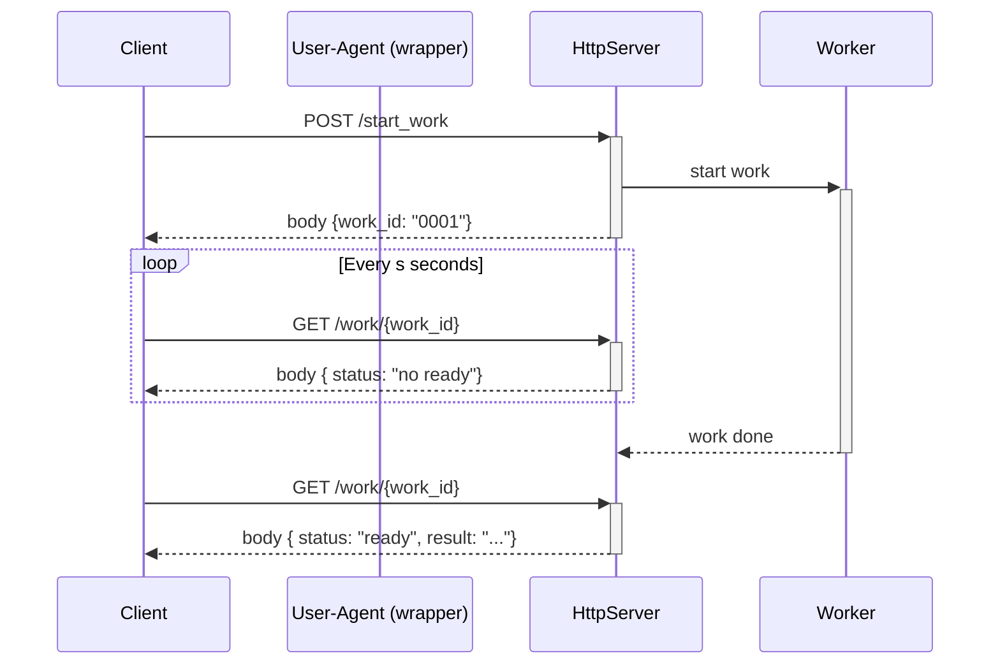
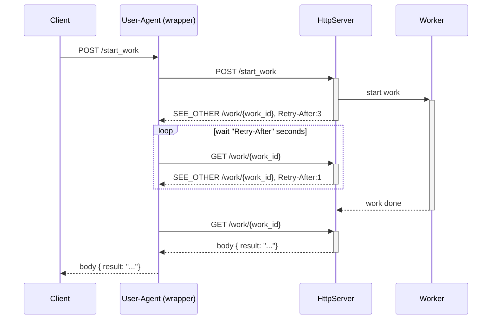

# Experimentation: Polling with http

Polling is a way to handle long or delayed work without blocking a TCP connection. To do polling on http server we need at least 2 endpoints:

- the endpoint to start the work (eg: `POST /start_work`)
- the endpoint to provide the result of the work when ready, or a "not ready yet" status to tell "retry later" (eg `GET /work/{work_id}`)

This approach imply a **per endpoint** logic :-( !

- how to ready `work_id` form the result of `POST /start_work`
- how to convert `work_id` into request for `GET /work/{work_id}` and handle the response
- the retry interval is defined by documentation or arbitrary value

## Concept Evolution

- the server provide the interval, or at least an estimation for when to try next time
- the server provide the endpoint to get the result
- the information are provided via http status code & attribute like handling of authentication, trace, circuit breaker, rate-limit...

So on client side, the logic can handled in a endpoint agnostic way (eg at the user-agent wrapper level), and reuse for every endpoint that use polling.

### Pros

- server can adjust `Retry-After`, with estimation based on current load, progress of the work,...
- server can adjust the location of the response maybe to add complementary query param,...
- the protocol becomes is agnostic of the endpoint (may could become a "standard")
- the client & user-agent are free to handle the polling as they want, it could like in the first example (with more information) or with a more complex way with queue intermediate state, via sidecar or proxy...
  - user-agent is free to follow redirect automatically or not, and to handle them as a blocking or non-blocking way
  - user-agent handle retry-after like retries on
    - rate-limit: 429 (Too Many Request) + Retry-After
    - downtime: 503  (Service Unavailable) + Retry-After
    - ...
  - the `work_id` & polling can be nearly hide to Client, it's like a regular POST request that return the response

### Cons

- the Client should handle response of `GET /work/{work_id}` as response of `POST /start_work` (both possible error,...)
- the user-agent should change the method from POST to GET on redirection (allowed for 301 (Move Permanently), 302 (Found), 303 (See Other)), this behavior can coded at the user-agent wrapper level.

### References

Extracted from [RFC 7231 - Hypertext Transfer Protocol (HTTP/1.1): Semantics and Content](https://datatracker.ietf.org/doc/html/rfc7231#section-6.4.4) similar info available at M

- `303 See Other`
  
  > ... This status code is applicable to any HTTP method.  It is primarily used to allow the output of a POST action to redirect the user agent to a selected resource, since doing so provides the information corresponding to the POST response in a form that can be separately identified, bookmarked, and cached, independent of the original request. ...

- `Retry-After`
  > ... When sent with any 3xx (Redirection) response, Retry-After indicates the minimum time that the user agent is asked to wait before issuing the redirected request. ...

Extracted from [Retry-After - HTTP | MDN](https://developer.mozilla.org/en-US/docs/Web/HTTP/Headers/Retry-After)

> The Retry-After response HTTP header indicates how long the user agent should wait before making a follow-up request. There are three main cases this header is used:
>
> - When sent with a 503 (Service Unavailable) response, this indicates how long the service is expected to be unavailable.
> - When sent with a 429 (Too Many Requests) response, this indicates how long to wait before making a new request.
> - When sent with a redirect response, such as 301 (Moved Permanently), this indicates the minimum time that the user agent is asked to wait before issuing the redirected request.
