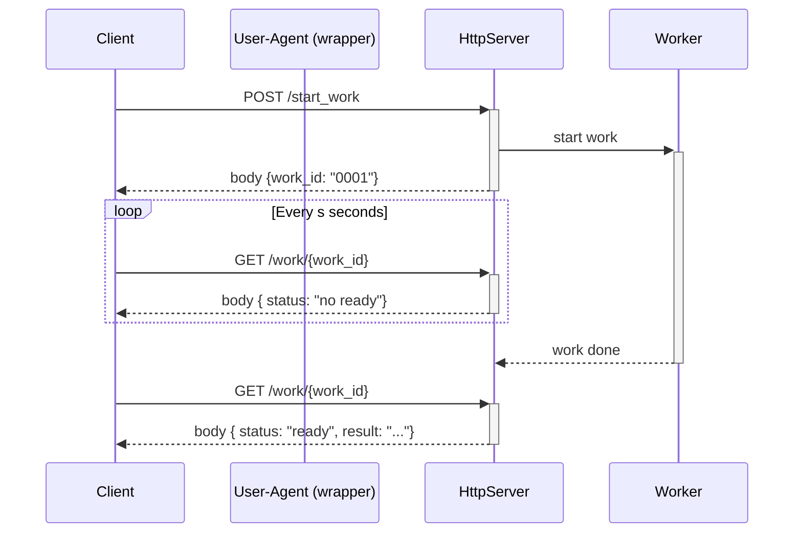
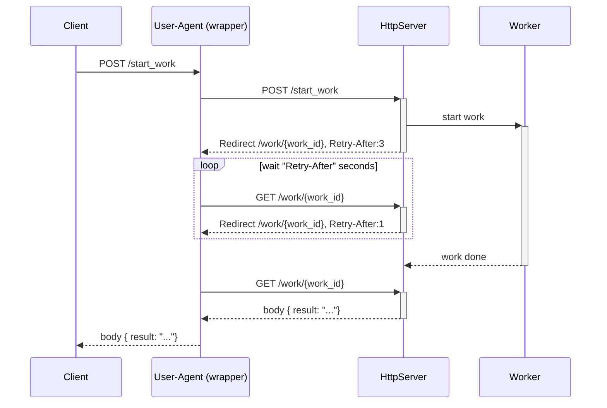

# Experimentation: Polling with http

Polling is a way to handle long or delayed work without blocking a TCP connection. To do polling on http server we need at least 2 endpoints:

- the endpoint to start the work (eg: `POST /start_work`)
- the endpoint to provide the result of the work when ready, or a "not ready yet" status to tell "retry later" (eg `GET /work/{work_id}`)

This approach imply a **per endpoint** logic :-( !

- how to ready `work_id` form the result of `POST /start_work`
- how to convert `work_id` into request for `GET /work/{work_id}` and handle the response
- the retry interval is defined by documentation or arbitrary value

Evolution:

- the server provide the interval, or at least an estimation for when to try next time
- the server provide the endpoint to get the result
- the information are provide via http status code & attribute like handling of authentication, trace, circuit breaker,...

So on client side, the logic can handled in a endpoint agnostic way (eg at the user-agent wrapper level), and reuse for every endpoint that use polling.

Pros:

- server can adjust `Retry-After`, with estimation based on current load, progress of the work,...
- server can adjust
- client is free to follow redirect automatically or not, and to handle them is a blocking or non-blocking
- the protocol becomes is agnostic of the endpoint (may could become a "standard")
- the `work_id` & polling is nearly hide to Client
- the client & user-agent are free to handle the polling like in the first example (with more information)

Cons:

- the Client should handle response of `GET /work/{work_id}` as response of `POST /start_work` (both possible error,...)
